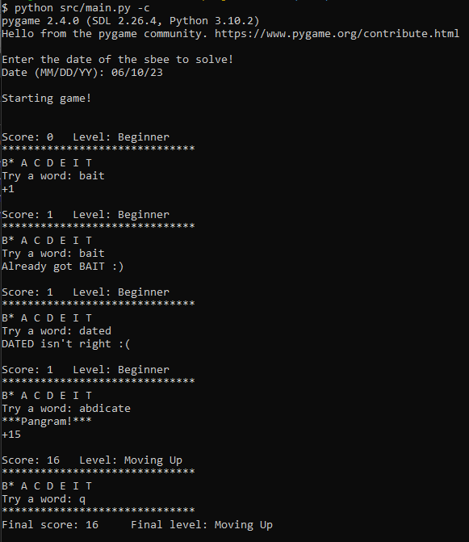
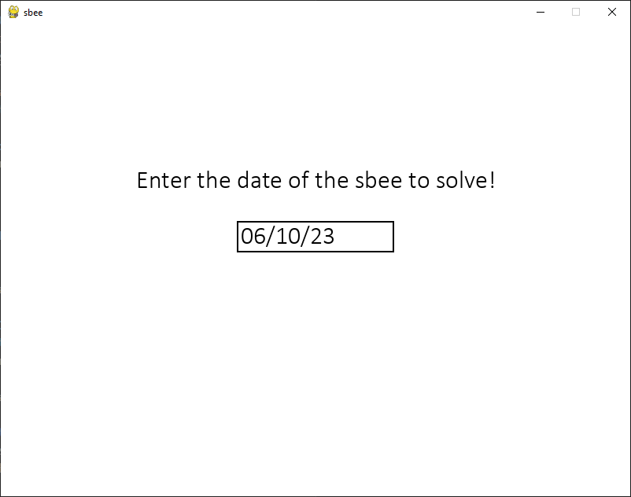
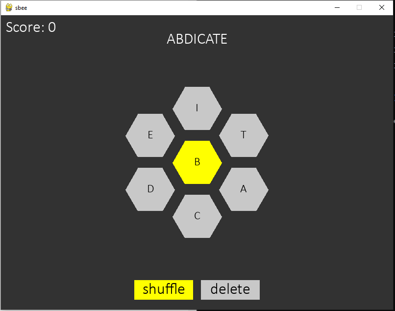
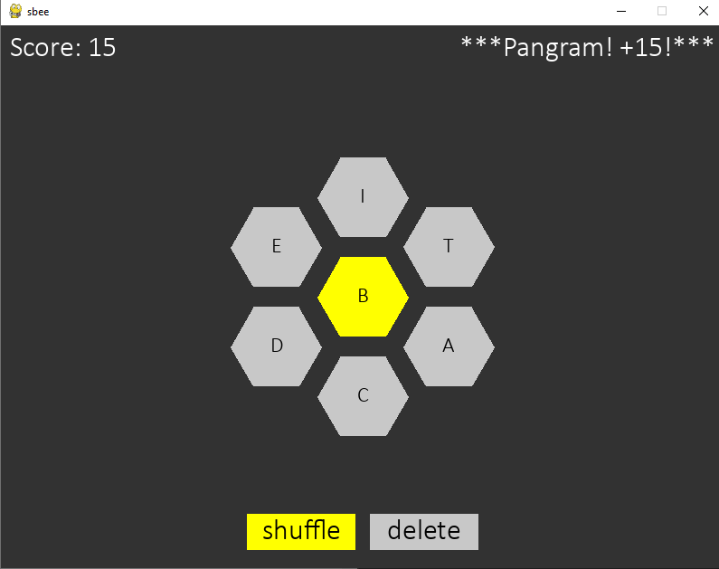

# Sbee

## Description
Spelling bee game that scrapes from sbsolver.com and follows the NYT Spelling Bee scoring system. 

## Table of Contents
- [Installation](#installation)
- [Gameplay and Usage](#gameplay-and-usage)
  - [Command Line Mode](#command-line-mode)
  - [Graphical Version](#graphical-version)
- [Screenshots/Demo](#screenshotsdemo)

## Installation
Dependencies are included in the folder. Start the virtual environment: 
- On Unix or MacOS, using the bash shell: source Scripts/activate
- On Unix or MacOS, using the csh shell: source Scripts/activate.csh
- On Unix or MacOS, using the fish shell: source Scripts/activate.fish
- On Windows using the Command Prompt: Scripts\activate.bat
- On Windows using PowerShell: Scripts\Activate.ps1

## Gameplay and Usage
The objective is to create as many words as possible using the given letters while including the designated center letter in each word. Four-letter words earn one point, longer words earn one point per letter, and pangrams earn a bonus seven points. 

### Command Line Mode
Run the game in the command line mode by running the main.py file with the `-c` flag. 

```$ python src/main.py -c```

Try words by typing into the command line and pressing enter. Quit by entering "q".

### Graphical Version
To run the graphical version, simply run the main.py file. 

```$ python src/main.py```

At the startup screen, click the box to type in a date in "MM/DD/YY" format, and press enter to get the spelling bee game for that date. Press the letters or type on your keyboard to type a word, and press enter to try it. Press the shuffle button to shuffle the non-center letters. Quit the game by closing the window.


## Screenshots/Demo






